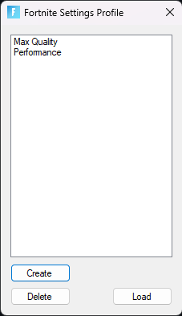

# Fortnite settings profiles
With this app you can create Fortnite settings profiles and quickly switching between them.

## 🧐 Features    
- Quick Switching
- Simple GUI
- Settings backup
- Portable

        

## 🧑🏻‍💻 Usage
After downloading the file from releases just start the exe file and you're ready to go.

## 🛠️ Tech Stack
- [C#](https://en.wikipedia.org/wiki/C_Sharp_(programming_language))
- [.NET Framework](https://dotnet.microsoft.com/)

## ➤ License
Distributed under the Apache License. See [LICENSE](LICENSE) for more information.
        
